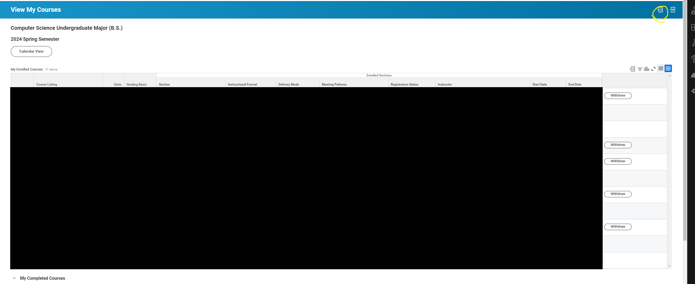

# Workday Spreadsheet to ICS

### What is it?

It is a tool where the compiled jar is run within a directory with a Workday Spreadsheet (.xlsx) to output a formatted complete calendar in the form of an iCalendar file (.ics) which can then be imported into your calendar program of choice.

### How does it work?
The program works by converting the Workday spreadsheet class infomation into a formatted iCalendar file using Java

## Prerequisites
Java: 21 JDK and up

### How to use?

1. Insure you have Java 21 or higher installed in your system
2. Download the .jar file from the latest release on github
3. Download your class Workday spreadsheet off of your View Courses page using the button circled in the image below in the top right hand corner

4. Place both your spreadsheet and jar file in the same folder and double click the jar file
5. The .ics file should now be generated and your done

#### Note:
Tool was originally designed for use by Stevens Institute of Technology students and has not been tested for any other school implementation of Workday spreadsheet formatting (Your results may vary). Any additional faculty infomation not on the spreadsheet but on a website will not be included.

 

